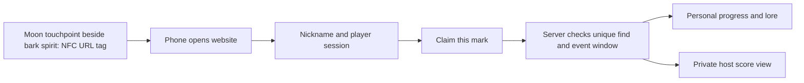

# Website implementation brief • proposal, not built
For a small custom site serving at most about 60 guests. This is the technical planning note; technical language does not belong on the guest screens.

## Guest flow
1. Discover a bark spirit and bring the phone to the moon-covered NFC tag immediately beside/below it. No QR flow.
2. Open the totem’s HTTPS link in the phone browser.
3. On the first visit, choose a nickname and join. Keep the pending totem intact through signup.
4. Tap **Claim this mark**. Show its short story and personal progress, e.g. “4 of 12 witnesses found.” The denominator must come from active totems, not a hard-coded value; final count proposed at 10–15.
5. A repeat visit says **Already found** and awards no additional points. After cutoff show lore plus **The crown has been chosen**.

No app install, social login, email address, phone number, GPS request, or browser NFC permission should be necessary. Do not make Add to Home Screen a requirement.

## Recommended structure

Use a stable public HTTPS origin with mobile-friendly pages, a small backend and a transactional datastore. Avoid making this depend on the Mac that is already running music and TV. Hosting provider, domain and deployment method remain choices for the implementation task.

## Data and identity
- Event: ID, opening/closing timestamps, state, active totems.
- Totem: ID, random claim token, name, lore, enabled flag. One canonical link encoded on its concealed NFC tag.
- Player: random ID, nickname, session credential, optional recovery credential.
- Claim: event, player, totem, server timestamp, normal/helper source. Enforce a unique constraint on event + player + totem.
- Admin action: correction, reason and timestamp.

Use an HttpOnly secure first-party session cookie for returning players, plus a separate recovery code they can save if needed. Do not identify a player merely by their nickname. If NFC opens a different browser or private browsing clears the session, recovery must restore that player instead of silently merging unrelated nicknames. The MVP cannot guarantee one real human per cookie; if duplicate entrants become a concern, helpers can issue one entrant code per person. That adds setup and should be an explicit choice.

## Claim handling
- A GET only displays the page. A POST initiated by **Claim this mark** creates the claim, so link previews and prefetching do not score.
- Award a point only after the server confirms a valid active token and an open event. Do not trust client clocks or a score stored on the phone.
- Use atomic insert/uniqueness so simultaneous tabs or retries cannot double-count.
- Reject inactive/unknown tokens cleanly. Keep nickname rendering escaped, input bounded, and admin routes authenticated.
- Rate-limit abusive claims, but allow 30–60 guests sharing one Wi-Fi IP. Prefer per-session/token limits to an aggressive IP-only threshold.
- Use random unguessable route tokens and omit hidden totem URLs from public lists/client bundles. This reduces guessing; it does not prevent forwarding a real link.
- A manual helper claim must use the same uniqueness rule. An assisted claim can never create a second point for an existing claim.
- Store times in UTC and display New York time. Proposed opening: `2026-10-31T22:30:00-04:00`; cutoff: `2026-11-01T00:30:00-04:00`. Explicit offsets avoid the repeated-hour problem.

## Host controls
Open/pause/close game; activate/deactivate totem; view ranked scores and ties; record justified paper/helper finds; correct a claim; export score snapshot before the ceremony. The server enforces cutoff regardless of the page’s displayed timer. A host confirmation selects the willing winner after tie handling; no automatic public naming without checking presence.

Default guest pages show personal progress only. Avoid indexing the game, third-party trackers, and address/contact data. A practical proposed cleanup is deleting nicknames/session data a week after the party while retaining anonymous totals; host can choose retention at build time.

## Physical preparation
Resolve the final HTTPS domain before writing tags. One short NDEF URI record per tag; verify exact route and pending-claim preservation on both platforms. Do not generate or print QR codes. Keep the totem-name/placement register private to helpers. Do not permanently lock tags until the complete mounted prototype and both phone routes pass; locking is often irreversible.

## Required tests
- iPhone + Android: NFC tap, nickname signup, claim, return to second totem, repeat claim, recovery after browser change.
- Physical: final tag mounting, phone case, low light, one guest holding a drink, and reachable placement.
- Scoring: duplicate POST, two tabs, two players on one totem, invalid token, before opening/after cutoff, paused game, helper/normal duplicate.
- Connectivity: weak Wi-Fi or cellular, failed request/retry, no false success when server is unavailable.
- Admin: tie at maximum score, winner absent/declines, final export and readable paper fallback.
- Hosting: direct navigation to every tag URL works; no deep-link 404; no dependency on a localhost address.

No website, live URL, database, tag encoding or hosted deployment has been created by this research task.

## NFC-only physical interface
Do not create QR assets, camera-scanning screens or QR fallback instructions. [Moon touchpoint brief](06-bark-spirits-and-moon-touchpoints.md) governs the current mounting proposal. Helper-assisted claims must explicitly select/authenticate the guest player ID; scanning with a helper phone must not award the helper. Guests without a usable phone may receive a separate helper-managed player code. Keep normal/helper claims under the same uniqueness constraint.
